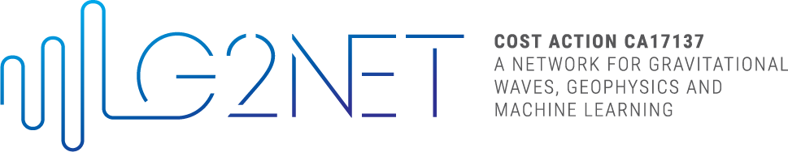
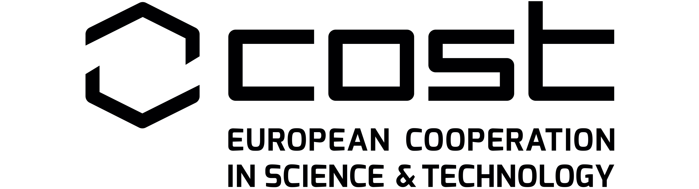
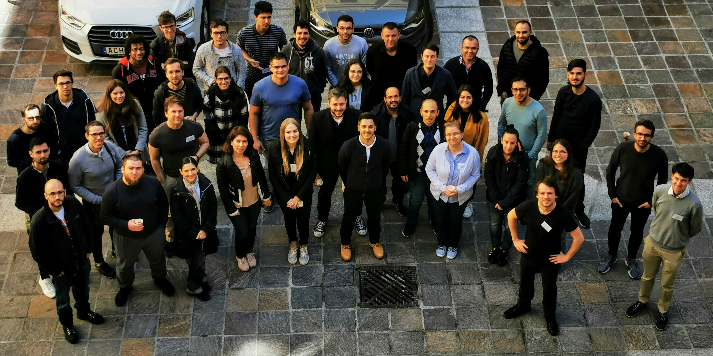
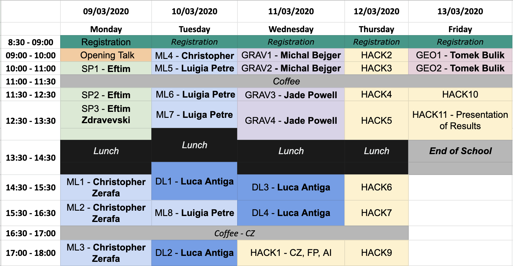

# [g2net](https://www.g2net.eu/) - 2nd Training School - Machine Learning and Signal processing for Time Series Analysis
## CA17137 - A network for Gravitational Waves, Geophysics and Machine Learning

Teaching material for '[g2net - 2nd Training School - Machine Learning and Signal processing for Time Series Analysis](https://indico.ego-gw.it/event/46/)' held at the University of Malta, Valletta Campus, Malta, 9-13 March 2020.

----

## TimeTable 

| **Module Code** | **Topic**                   |
|:-------------:|-------------------------|
| SP          | Signal Processing       |
| ML          | Machine Learning        |
| DL          | Deep Learning           |
| GRAV        | Gravitational Data Talk |
| GEO         | Geophysical Data Talk   |
| HACK        | ML Hackaton             |

## Lectures
- **SP** - Signal Processing - Eftim Zdravevski
    - [SP1 - Preparing Environment](lectures/SP_Signal_Processing_Introduction-Eftim_Zdravevski/signal_processing_0_preparing_environment.ipynb)
    - [SP2 - Introduction and Visualization](lectures/SP_Signal_Processing_Introduction-Eftim_Zdravevski/signal_processing_1_introduction_and_visualization.ipynb)
    - [SP3 - Preparing GW Data](lectures/SP_Signal_Processing_Introduction-Eftim_Zdravevski/signal_processing_2_preparing_GW_data.ipynb)
- **ML** - Machine Learning - Christopher Zerafa, Luigia Petre
    - [CZ - ML1 - Introduction to Python & Machine Learning](lectures/ML_Christopher_Zerafa/ML1_Intro_Python_ML/ML1_Intro_Python_ML.md)
    - [CZ - ML2_3 - Classification vs Regression and Metrics](lectures/ML_Christopher_Zerafa/ML2_3_Classification_Regression_Metrics/ML2_3_Classification_Regression_Metrics.md)
    - [CZ - ML4 - Model Selection and Feature Engineering](lectures/ML_Christopher_Zerafa/ML4_Model_Selection/ML4_Model_Selection.md)
    - [LP - ML5_6 - Trees And Ensembles](lectures/ML_Luigia_Petre/ML5_6_TreesAndEnsembles.ipynb)
    - [LP - ML7 - Naïve Bayes](lectures/ML_Luigia_Petre/ML7_naiveBayes.ipynb)
    - [LP - ML8 - Support Vector Machines](lectures/ML_Luigia_Petre/ML8_SupportVectorMachines.ipynb)
- **DL** - Deep Learning - Luca Antiga
    - Lectures
        - [DL1_2 - Neural networks and back-propagation & PyTorch basics](lectures/DL_Luca_Antiga/g2net_part1.pdf)
        - [DL3_4 - Deep learning in PyTorch & Deep learning for g2net data](lectures/DL_Luca_Antiga/g2net_part2.pdf)
        - [Lecture Recording - DL1](https://youtu.be/LBMAUEdNWDk)
    - Notebooks
        - [1.1-PyTorch-Basics](lectures/DL_Luca_Antiga/1.1-PyTorch-Basics.ipynb)
        - [1.2-Linear-Regression](lectures/DL_Luca_Antiga/1.2-Linear-Regression.ipynb)
        - [1.3-Multi-Class-Logisitc-Regression](lectures/DL_Luca_Antiga/1.3-Multi-Class-Logisitc-Regression.ipynb)
        - [2.1-Convolutional-Neural-Networks](lectures/DL_Luca_Antiga/2.1-Convolutional-Neural-Networks.ipynb)
        - [2.2-Pretrained-ResNet-Imagenet](lectures/DL_Luca_Antiga/2.2-Pretrained-ResNet-Imagenet.ipynb)
        - [2.3-TransferLearning-MNIST](lectures/DL_Luca_Antiga/2.3-TransferLearning-MNIST.ipynb)
        - [2.4-Finetuning-Hymenoptera](lectures/DL_Luca_Antiga/2.4-Finetuning-Hymenoptera.ipynb)
        - [2.5-CharRNN](lectures/DL_Luca_Antiga/2.5-CharRNN.ipynb)
- **GRAV**	- Gravitational Data Talk - Michal Bejger, Jade Powell
    - [MB - GRAV1_2 - Introduction to Gravitational Waves](lectures/GRAV_Intro_gw12_bejger_g2net_malta.pdf)
    - [JP - GRAV3_4 - Gravitational Wave Data Analysis with Machine Learning](lectures/GRAV_GW_Data_Jade_Powell.pdf)
- **GEO**	- Geophysical Data Talk - Tomek Bulik, Gregory Beroza
    - TB - GEO1_2
        - [Slides](lectures/GEO_Tomasz_Bulik_Introduction_to_geophysics.odp)
        - [Recording](https://youtu.be/t84sOY8Czic)
    - GB - GEO3 - Deep Learning Applied to Earthquake Signals
        - [Slides](lectures/GEO_DL_Applied_to_ES_Beroza.pdf)
        - [Recording](https://youtu.be/3_0HWgzIXw8)
- **HACK**	- Machine Learning Hackaton - Christopher Zerafa, Filip Morawski, Alberto Iess
    - Platform: [g2net - Hack](http://88.198.90.93/)
    - Notebooks: [g2net_malta_hackaton](https://github.com/zerafachris/g2net_malta_hackaton)
    - Data: [datasets](https://www.kaggle.com/zerafachris/g2net-training-school-hackaton)
    - Deadline: _**Friday 13/03/2020 13:00 GMT+1**_
    - Baseline Model: [notebook](HACK_leader_board/HACK_Baseline_Model/99_ML_Random_Forest_Baseline.ipynb)
    - [Recording](https://youtu.be/jUvC_xzjABQ)
    - Leaderboard:
    
    | Rank |  Participant Name  | Notebook | Score (balanced_accuracy) |
    |:------:|:------------------|:--------|:---------------------------:|
    | 1    |     Ondřej Zelenka | [script_1](HACK_leader_board/HACK_1_hackathon_final_model_zelenka)            | 81%                       |
    | 2    |     Filip Morawski | [notebook_2](HACK_leader_board/HACK_2_Random_Forrest_new_meta.ipynb)        | 78%                       |
    | 3    | Christopher Zerafa | [notebook_3](HACK_leader_board/HACK_3_zerafachris/99_ML_v2_02_Augment_With_Avg_Noise.ipynb)        | 76%                       | 
    

## Resources
- [Deep Learning with PyTorch](https://www.manning.com/books/deep-learning-with-pytorch)

## Photos
You can find photo album with pictures [here](https://photos.app.goo.gl/UshkScGxn7LBtMXR6).

---