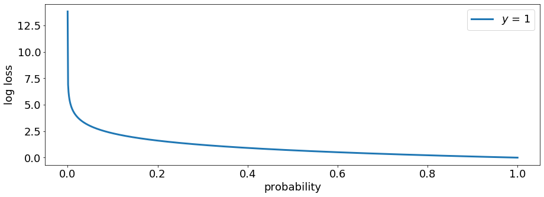
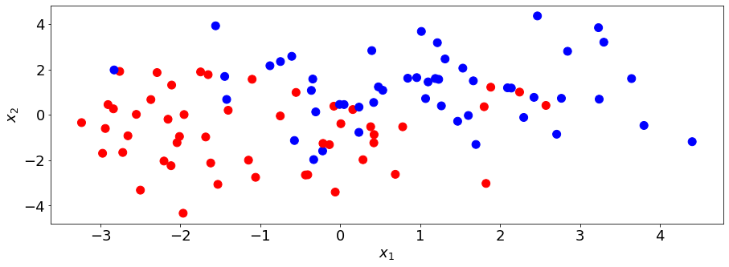
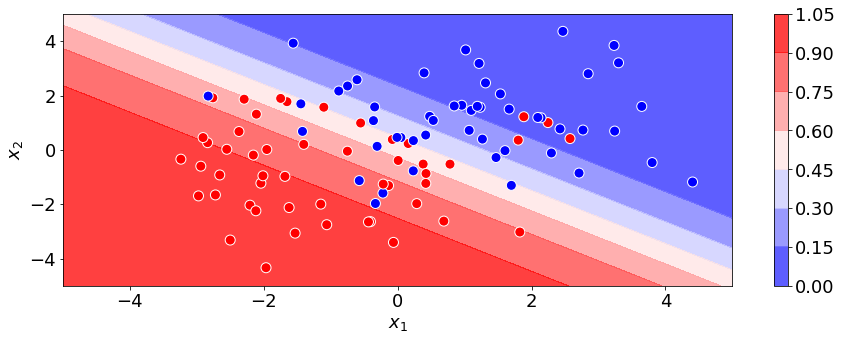
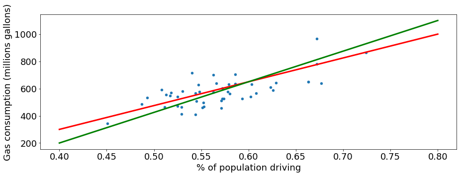
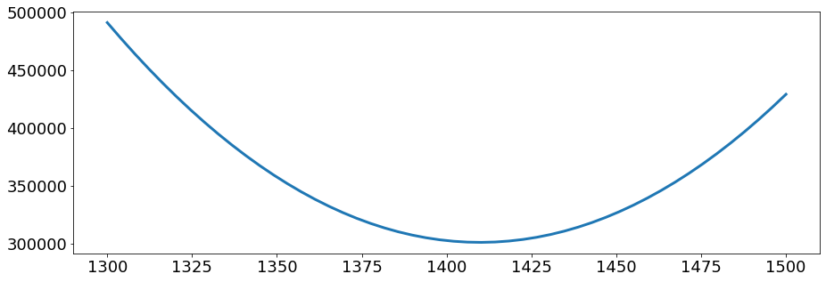
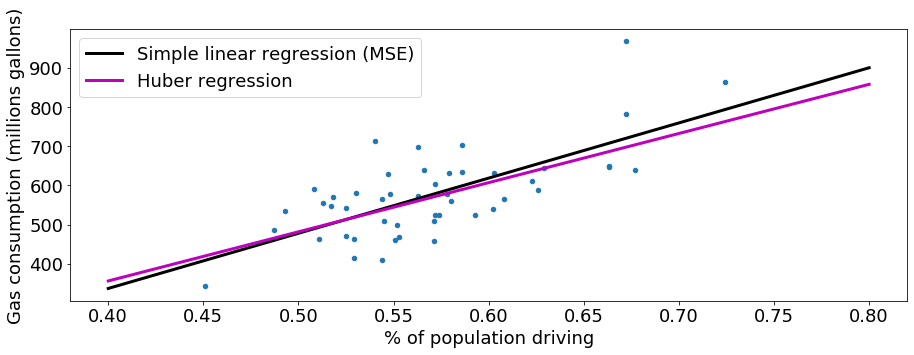
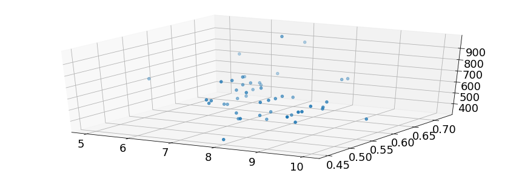

```python
import matplotlib
import seaborn as sns
import matplotlib.pyplot as plt
import pandas as pd
```


```python
matplotlib.rcParams.update({'font.size': 18,
                            'lines.linewidth' : 3,
                           'figure.figsize' : [15, 5],
                           'lines.markersize': 10})
pd.options.mode.chained_assignment = None
```

# Classification

In classification, we predict categorical labels. In regression, we predict quantitative/numerical labels. The critical difference is that we can't take a difference between the predicted and actual category in classification, while we can take a difference between the predicted and actual numerical values in regression. Because of these differences between regression and classification, we use different metrics to evaluate machine learning models trained for classification.

As with regression, we are trying to determine the model $f$ that can best describes the relationship

$$ y_j = f(X_j). $$

For classification, $y_j$ can only take a finite set of values. If there are only two such values, we are dealing with **binary** classification. Examples of binary classification are predicting whether it will rain or not and whether someone will default on their loan. If we have more than two classes, we have a **multiclass** problem. For example, image classification is usually multiclass as we are trying to identify an image among a set of values, e.g., a person, a road sign, a car, etc.

## Accuracy

A natural choice for a metric for classification is accuracy. Accuracy is equal to the number of observations you correctly classified over all observations. For example, if your model properly identified 77 out of 100 images, you have an accuracy of 77%. Accuracy is an easy metric to both understand and calculate. Mathematically, it is simply

$$ \frac{\text{number of correct observations}}{\text{number of observations}}.$$

However, accuracy may not always be a good metric. Consider the case of disease detection where only 10% of the observations have the disease. A naive classifier that always predicts the majority class will achieve 90% accuracy. 
While the naive model correctly identifies everyone without the disease, it fails to identify any person with the disease. We need a metric that will tell us how well our model performs for a particular class.

## Precision and recall

For the example of disease detection, we are more interested in determining our model's performance with regards to the class representing having the disease. Let's call this class  **positive** and not having the disease as **negative**. Particularly, we want to know what fraction of all positive predictions were correct and what fraction of positive observations did we identify. The two metrics that describe these values are precision and recall. Precision is the fraction of true positives over all positive predictions. It is a measure of how "precise" our model was with regards to labeling observations as positive. Recall, on the other hand, is equal to the fraction of true positives over all positive observations. It is a measure of our model's ability to "catch" and properly label observations that are positive.

A confusion matrix is a table summarizing the performance of the model by enumerating true and false positives and the true and false negatives.

|                *     | Positive Observation     | Negative Observation    |
|---------------------|:------------------------:|:-----------------------:|
| Positive Prediction |     True Positive (TP)   | False Positive (FP)     |
| Negative Prediction | False Negative (FN)      |     True Negative (TN)  |

Given the definitions used earlier, the equation for precision and recall are

$$ \text{precision} = \frac{\text{TP}}{TP + FP}$$
and
$$ \text{recall} = \frac{\text{TP}}{TP + FN}. $$

Note, the difference between the metrics is their denominator. In our disease detection example, if we labeled 12 observations as positive but only 8 were actually true positives, our precision is 0.667. If our data set had 10 positive observations, since we correctly identified or "recalled" 8 of them, our recall is 0.8. If we had used the naive model that predicts the majority class, the recall would be 0 and our precision would be undefined.

What is more important, precision or recall? The answer depends on the specifics of the problem. Having a model that prioritizes less false positives will have a higher precision and a model that aims to reduce the number of false negatives will have a higher recall. You must decide whether your model should prioritize reducing false positives or false negatives. It is often helpful to consider the cost, whether financial, societal, etc., of your model making false positives and false negatives.

**Questions**
* For disease detection, is it better to have a higher precision or recall?
* Does our answer change if we need to have diagnosed patients undergo invasive and risky procedures?
* Is admissions to a top-tier university a high recall or high precision process?  

**Questions**
* For disease detection, is it better to have a higher precision or recall?
    - **Recall**: We want to identify as much of the people as possible
* Does our answer change if we need to have diagnosed patients undergo invasive and risky procedures?
    - **Precision**: We want to do surgery on people that actually need it
* Is admissions to a top-tier university a high recall or high precision process?  
    - **Precision**: There is a finite number of places in the university.

*There is a finite number of slots. So we need to be very precise - PRECISION*

We can easily calculate classification metrics using the `sklearn.metrics` module. Let's first generate the result of our fictitious disease detection model. In addition to precision and recall, there is that $F_1$ score which is the harmonic mean of precision and recall. It is a nice metric to use when we don't have a preference over precision and recall. Note, the function `metrics.classification_report` will calculate the metrics for both scenarios of what class is considered positive or negative.


```python
import numpy as np
from sklearn import metrics

# generate our results
y_pred = np.zeros(100, dtype=np.int32)
y_pred[:12] = 1
y = np.zeros(100)
y[:8] = 1
y[-2:] = 1

print("precision: {:g}".format(metrics.precision_score(y, y_pred)))
print("recall: {:g}".format(metrics.recall_score(y, y_pred)))
print(metrics.classification_report(y, y_pred))
```

    precision: 0.666667
    recall: 0.8
                  precision    recall  f1-score   support
    
             0.0       0.98      0.96      0.97        90
             1.0       0.67      0.80      0.73        10
    
        accuracy                           0.94       100
       macro avg       0.82      0.88      0.85       100
    weighted avg       0.95      0.94      0.94       100
    


## Probabilistic Classification Models
Some classification models do not directly predict a class for an observation but instead reports a probability. For example, it might predict that there's a 75% chance the observation is positive. For the preceding example, should we assign a positive or negative label? The natural choice is to assign the observation as positive since the predicted probability is greater than 50%. However, we don't have to stick to 50%; we can adjust our **threshold** and only classify observations as positive if our models predicts a greater than 90% probability. By increasing the threshold, we will make our model only make positive predictions when it is very certain and confident. Conversely, if we lower our threshold, our model will more liberally assign positive labels. Adjusting threshold affects the models precision and recall. 

As we started to see earlier, there is tradeoff between precision and recall that becomes more apparent with probabilistic models. Let's explore and visualize the tradeoff between precision and recall. We'll generate some data 


```python
# generate data
np.random.seed(0)
y_proba = np.linspace(0, 1, 1000)
y_pred = (y_proba > 0.5).astype(np.int32)
y = np.random.binomial(1, y_proba)

print("accuracy: {}".format(metrics.accuracy_score(y, y_pred)))
```

    accuracy: 0.749


```python
precision, recall, threshold = metrics.precision_recall_curve(y, y_proba)
f1_score = 2*precision*recall/(precision + recall)
threshold = np.hstack((0, threshold))

plt.plot(threshold, precision)
plt.plot(threshold, recall)
plt.plot(threshold, f1_score)
plt.xlabel('threshold')
plt.legend(['precision', 'recall', '$F_1$']);
```


In the above figure, we see how increasing the threshold led to higher precision but lower recall. The threshold that yielded the largest $F_1$ score was about 0.36. Any probabilistic model can achieve any arbitrary level of precision and recall by adjusting the threshold. As such, when comparing the performance of probabilistic classifiers, we need a single metric that is not dependent on threshold.

## Area under the curve
The precision-recall curve illustrates the tradeoff for a particular classifier. While there will always be a tradeoff between these two metrics, ideally the tradeoff should not be severe. In other words, the model should not sacrifice a large amount of precision to slightly improve recall. We can visualize the degree of the tradeoff by plotting what is known as a precision-recall curve.


```python
plt.plot(recall, precision)
plt.xlabel('recall')
plt.ylabel('precision')
plt.xlim([0, 1])
plt.ylim([0, 1]);
```


We want a model that has less tradeoff between precision and recall, resulting in a curve with less of a drop with increasing recall. Geometrically, it is better to have a model with a larger area under the curve, **AUC**, of its precision-recall plot. In `scikit-learn`, the AUC can be calculated using the `metrics.auc` function. In addition to **AUC**, there is the **ROC-AUC** metric which is based on the receiver-operator curve (ROC). The ROC plots the true positive rate against the false negative rate.


```python
print("precision-recall AUC: {}".format(metrics.auc(recall, precision)))
print("receiver-operator AUC: {}".format(metrics.roc_auc_score(y, y_proba)))
```

    precision-recall AUC: 0.8321070511189885
    receiver-operator AUC: 0.8325272527252727


In the example, the resulting model had similar values for AUC and ROC. In general, if your data is imbalanced (more observation of the negative class) or if you care more about false positives you should rely on AUC of the precision-recall curve. Note, the number of true negatives are not factored in calculating either precision or recall.

## Log loss
A metric often used for optimizing probabilistic classifiers is the log loss function, sometimes referred to as cross entropy. Log loss takes into account uncertainty of your models predictions, something accuracy does not do. The equation for the log loss is

$$ -\sum \left[y_j \log(p_j) + (1-y_j)\log(p_j) \right], $$

where $y_j$ is the class label of an observation, either 0 or 1, and $p_j$ is the probability the observation is in class 1. The lower the log loss, the better the model.

The log loss is harder to interpret than other metrics such as accuracy. It measures not only whether the model will correctly classify an observation but rewards the model if it's confidence of a correct prediction is high. Conversely, it will severely penalize the model for being overly confident in a prediction that is wrong. For example, a model will have a lower log loss if it predicts a probability of 95% for an observation of class 1 than if it had predicted 60%. Thus, it is possible for two models to have the same accuracy yet have different log loss. Despite being slightly harder to interpret, it reveals more information of a model's performance than accuracy. The figure below displays the reduction of log loss as a model becomes more certain in its prediction.


```python
p = np.linspace(1E-6, 1-1E-6, 1000)
y = 1
log_loss = -(y*np.log(p) + (1 - y)*np.log(1 - p))

plt.plot(p, log_loss)
plt.xlabel('probability')
plt.ylabel('log loss')
plt.legend(['$y$ = 1']);
```





## Logistic regression
The logistic regression model is the classifier version of linear regression. It is a probabilistic model; it will predict probability values that can then be used to assign class labels. The model works by taking the output of a linear regression model and feeds it into a sigmoid or logistic function. Mathematically

$$ p_j = S\left( \sum_{i} X_{ji}\beta_i  + \beta_0 \right), $$
where
$$ S(x) = \frac{1}{1 + e^{-x}} $$

The reason for the sigmoid function is that it maps values that range from positive to negative infinity to values that only range from 0 to 1. Thus, the output of the sigmoid function can be interpreted as a probability. An example of the sigmoid function is shown below.


```python
x = np.linspace(-10, 10, 100)
s = 1/(1 + np.exp(-x))

plt.plot(x, s)
plt.xlabel('$x$')
plt.ylabel('$S(x)$');
```


The $\beta$ coefficients of the model are chosen to minimize the log loss. Unlike linear regression, there is no closed-form solution to the optimal coefficient. Instead, the coefficients are solved using gradient descent.

Let's train a logistic regression model through `scikit-learn`. We'll first train a model and plot it's **decision boundary**. The decision boundary is a boundary (or hypersurface in larger dimensional spaces) that illustrates how the model classifies observations. A decision boundary is a nice way to visualize how the model is making predictions.


```python
from sklearn.datasets import make_blobs
X, y = make_blobs(centers=[[1, 1], [-1, -1]], cluster_std=1.5, random_state=0)

plt.scatter(X[:, 0], X[:, 1], c=y, cmap=plt.cm.bwr)
plt.xlabel('$x_1$')
plt.ylabel('$x_2$');
```





```python
from sklearn.linear_model import LogisticRegression

clf = LogisticRegression(solver='lbfgs')
clf.fit(X, y)
y_pred = clf.predict(X)

print("accuracy: {}".format(metrics.accuracy_score(y, y_pred)))
```

    accuracy: 0.84


```python
X1, X2 = np.meshgrid(np.linspace(-5, 5), np.linspace(-5, 5))
y_proba = clf.predict_proba(np.hstack((X1.reshape(-1, 1), X2.reshape(-1, 1))))[:, 1]
plt.contourf(X1, X2, y_proba.reshape(50, 50), cmap=plt.cm.bwr, alpha=0.75, vmin=0, vmax=0.95)
plt.colorbar()

plt.scatter(X[:, 0], X[:, 1], c=y, edgecolors='white', cmap=plt.cm.bwr)
plt.xlabel('$x_1$')
plt.ylabel('$x_2$');
```





Notice that the classifier forms a linear decision boundary; logistic regression models are referred to as linear classifiers. The model forms a linear boundary because there is a linear relationship between the features and the input of the sigmoid function.

## Multiclass classification for binary classifier
Some classifiers can only model problems with two classes. For example, logistic regression is a binary classifier. However, there are ways to modify binary classifiers to extend them to predict multiple classes. Two common methods are the **one-vs-all** and the **one-vs-one** scheme.

### One-vs-All
In one-vs-all, you train $k$ binary classifiers, where $k$ is the number of classes. Each binary classifier represents training with observation of class $k$ and class not $k$. The probability of being in each class is calculated using an equation that normalizes the output of each classifier

$$ p_k = \frac{f_k}{\sum_{k} f_k} , $$

where $f_k$ is the output of classifier $k$ and $p_k$ is the probability of the observation being in class $k$. Given the normalization, the sum of $p_k$ for all values of $k$ is equal to 1.

### One-vs-One
In one-vs-one, we training classifiers of all possible pairings between the classes. For example, if we have classes A, B, C, and D we train classifiers for A vs. B, A vs. C, A vs. D, B vs. C, B vs. D, and C vs. D. If we have $k$ classes, we train $k(k-1)/2$ classifiers.

**Question**
* If the one-vs-all scheme usually requires training less classifiers, when would it be better to deploy one-vs-one? 

**Question**
* If the one-vs-all scheme usually requires training less classifiers, when would it be better to deploy one-vs-one? 
    - OVO is much less sensitive to the problems of imbalanced datasets

# Regression

The power of quantitative sciences comes from the insight we can derive from mathematical relationships between different measurements. We can use these insights to make predictions about what will happen in the future. The simplest possible relationship between two variables is a linear relationship

$$y_i \approx \beta_0 + \beta_1x_i$$

If we can measure some $(x_i, y_i)$ pairs, we could calculate our _model parameters_ $\beta_0$ and $\beta_1$. Then we could predict $y$ in the future based on $x$, or even try to influence $y$ in the future by controlling $x$.


```python
gas = pd.read_csv('./00_data/gas_consumption.csv', names=['tax', 'income', 'highway', 'drivers', 'gas'])
gas.head()
```


<div>
<style scoped>
    .dataframe tbody tr th:only-of-type {
        vertical-align: middle;
    }

    .dataframe tbody tr th {
        vertical-align: top;
    }

    .dataframe thead th {
        text-align: right;
    }
</style>
<table border="1" class="dataframe">
  <thead>
    <tr style="text-align: right;">
      <th></th>
      <th>tax</th>
      <th>income</th>
      <th>highway</th>
      <th>drivers</th>
      <th>gas</th>
    </tr>
  </thead>
  <tbody>
    <tr>
      <td>1</td>
      <td>9.0</td>
      <td>3571</td>
      <td>1976</td>
      <td>0.525</td>
      <td>541</td>
    </tr>
    <tr>
      <td>2</td>
      <td>9.0</td>
      <td>4092</td>
      <td>1250</td>
      <td>0.572</td>
      <td>524</td>
    </tr>
    <tr>
      <td>3</td>
      <td>9.0</td>
      <td>3865</td>
      <td>1586</td>
      <td>0.580</td>
      <td>561</td>
    </tr>
    <tr>
      <td>4</td>
      <td>7.5</td>
      <td>4870</td>
      <td>2351</td>
      <td>0.529</td>
      <td>414</td>
    </tr>
    <tr>
      <td>5</td>
      <td>8.0</td>
      <td>4399</td>
      <td>431</td>
      <td>0.544</td>
      <td>410</td>
    </tr>
  </tbody>
</table>
</div>


```python
gas.plot(x='drivers', y='gas', kind='scatter')
plt.xlabel('% of population driving')
plt.ylabel('Gas consumption (millions of gallons)');
```


We could try to draw a line describing the trend in the data, but which is the best one?


```python
gas.plot(x='drivers', y='gas', kind='scatter')
plt.xlabel('% of population driving')
plt.ylabel('Gas consumption (millions gallons)')

plt.plot([.4, .8], [300, 1000], 'r-')
plt.plot([.4, .8], [200, 1100], 'g-');
```





In order to compare the different trend lines we need to define a **metric** for how well they describe the actual data. The metric should reflect what we value about our trend line. We want our trend line to reliably predict a y-value given an x-value, so it would be reasonable to construct our metric based on the **error** between the trend line and the y-values.

$$ e_i = y_i - (\beta_0 + \beta_1x_i) $$

We want to make the total error as small as possible. Since sometimes the errors will be positive and some will be negative, if we add them together they might cancel out. We don't care if the error is positive or negative, we want the _absolute value_ to be small. Instead of minimizing the total error, we'll minimize the total squared error. Often we divide it by the number of data points, $n$, which is called the **mean squared error** (MSE).

$$ MSE = \frac{1}{n}\sum_i e_i^2 $$

Since $e_i$ depends on our model parameters $\beta_0$ and $\beta_1$, we can tweak our model (the trend line) until the MSE is minimized. In the language of machine learning, the MSE would be called the **cost function** or **loss function**. For different machine learning tasks, we will define different cost functions (or **objective functions/utility functions**, which we seek to maximize instead of minimize).


```python
from sklearn.linear_model import LinearRegression
linreg = LinearRegression(fit_intercept=True)
linreg.fit(gas[['drivers']], gas['gas'])

gas.plot(x='drivers', y='gas', kind='scatter')
plt.xlabel('% of population driving')
plt.ylabel('Gas consumption (millions gallons)')

x = np.linspace(.4, .8).reshape(-1, 1)
print(x.shape)
plt.plot(x, linreg.predict(x), 'k-')
plt.plot([.4, .8], [300, 1000], 'r-')
plt.plot([.4, .8], [200, 1100], 'g-');
```

    (50, 1)


```python
(linreg.intercept_, linreg.coef_[0])
```


    (-227.3091174945256, 1409.8421113288002)


## Gradient descent

How did we find the model parameters that minimize the cost function? Let's plot the cost function with respect to $\beta_1$ to get an idea.


```python
beta0 = linreg.intercept_
beta1 = np.linspace(1300, 1500)

MSE = [((gas['gas'] - (beta0 + m * gas['drivers']))**2).sum() for m in beta1]

plt.plot(beta1, MSE);
```





If we started with some initial guess $\beta_1 = 1300$, we could simply follow the slope of the MSE downhill with respect to $\beta_1$. We could calculate the MSE around 1300 to work out which way is downhill, and then update $\beta_1$ in that direction. With each step we move closer and closer to the bottom of the valley at 1409.

This method of always going downhill from where we are is called **gradient descent**. In general the loss function could be very complicated and we won't be able to solve where the minimum is directly. Gradient descent gives us an algorithm for finding our way to the minimum when we don't know where it is in advance.

For example, the `HuberRegressor` also optimizes a linear model, but [uses a more complicated loss function](http://scikit-learn.org/stable/modules/linear_model.html#huber-regression). The Huber loss is less influenced by outliers than the MSE.


```python
from sklearn.linear_model import HuberRegressor
huber = HuberRegressor(fit_intercept=True, alpha=0)
huber.fit(gas[['drivers']], gas['gas'])
gas.plot(x='drivers', y='gas', kind='scatter')
plt.xlabel('% of population driving')
plt.ylabel('Gas consumption (millions gallons)')

x = np.linspace(.4, .8).reshape(-1, 1)
plt.plot(x, linreg.predict(x), 'k-')
plt.plot(x, huber.predict(x), 'm-')
plt.legend(['Simple linear regression (MSE)', 'Huber regression']);
```





## Multivariate regression

Looking again at our DataFrame, we see we have other variables we could use to predict gas consumption.


```python
from ipywidgets import widgets

feature_desc = {'tax': 'Gas tax', 'drivers': '% of population driving', 'income': 'Average income (USD)', 'highway': 'Miles of paved highway'}
def plot_feature(column):
    plt.plot(gas[column], gas['gas'], '.')
    plt.xlabel(feature_desc[column])
    plt.ylabel('Gas consumption (millions gallons)')

dropdown_menu = {v: k for k, v in feature_desc.items()}

widgets.interact(plot_feature, column=dropdown_menu);
```


    interactive(children=(Dropdown(description='column', options={'Gas tax': 'tax', '% of population driving': 'dr…


To use all of these predictors (called **features**), we will need to fit a slightly more complicated function

$$ y_i \approx \beta_0 + \beta_1x_{1i} + \beta_2x_{2i} + \beta_3x_{3i} + \beta_4x_{4i} $$

or more generally

$$ y_i \approx  \sum_j\beta_jX_{ij} $$

where $i$ labels different **observations** and $j$ labels different **features**. When we have one feature, we solve for a line; when we have two features, we solve for a plane; and so on, even if we can't imagine higher dimensional spaces.


```python
from mpl_toolkits.mplot3d import Axes3D

plt3d = plt.figure().gca(projection='3d')
plt3d.scatter(gas['tax'], gas['drivers'], gas['gas']);
```





```python
linreg.fit(gas[['tax', 'drivers']], gas['gas'])
```


    LinearRegression(copy_X=True, fit_intercept=True, n_jobs=None, normalize=False)


```python
plt3d = plt.figure().gca(projection='3d')

xx, yy = np.meshgrid(np.linspace(5, 11), np.linspace(.4, .8))
z = linreg.intercept_ + linreg.coef_[0] * xx + linreg.coef_[1] * yy
plt3d.plot_surface(xx, yy, z, alpha=0.2)
plt3d.scatter(gas['tax'], gas['drivers'], gas['gas']);
```


```python
from ipywidgets import interact

def plot_cross(tax=5):
    x = np.linspace(.4, .8)
    plt.plot(x, linreg.intercept_ + linreg.coef_[0]*tax + linreg.coef_[1]*x)
    alpha = 1 - abs(gas['tax'] - tax) / abs(gas['tax'] - tax).max()
    colors = np.zeros((len(gas), 4))
    colors[:, 3] = alpha
    plt.scatter(gas['drivers'], gas['gas'], color=colors)

interact(plot_cross, tax=(5,11,1));
```


    interactive(children=(IntSlider(value=5, description='tax', max=11, min=5), Output()), _dom_classes=('widget-i…


```python

```
